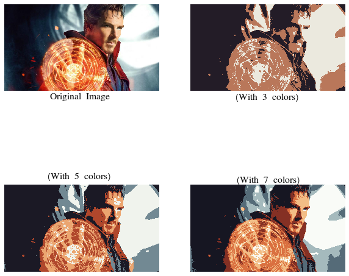

## Dominant Color Extraction for Image Segmentation

- **Segmentation** partitions an image into regions having similar visual appearance corresponding to parts of objects, this means finding the dominant colors for image segmentation.
- We will try to extract the most dominant 'K' Colors in the image using K-Means clustering algorithm by applying K-Means with each pixel which will reassigned to the closest of the K Colors, leading to segmentation and generate a new image with those dominant colours only. Number of dominant colors is a user specified parameter.

### The results will look like this:
 

<b> Different Types of Image Segmentation with different number of dominant colors </b>
 
